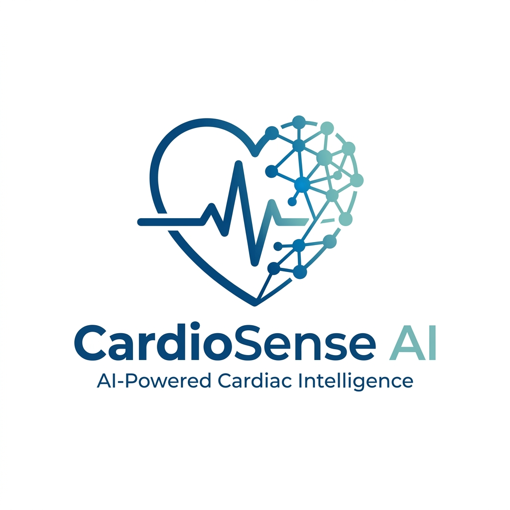
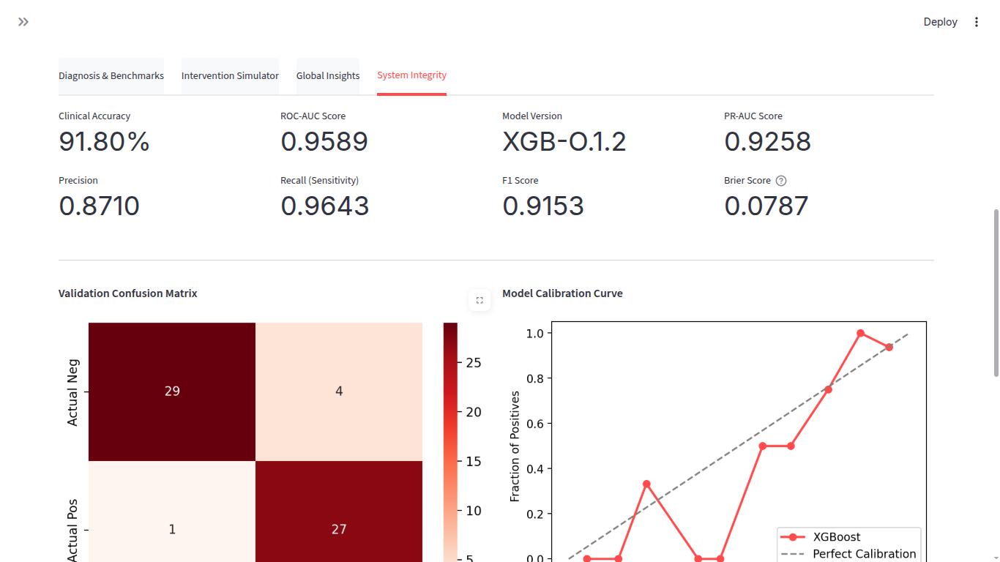

[](https://github.com/khanz9664/CardioSense-AI/actions/workflows/pipeline.yml)
[](https://cardio-sense-ai.streamlit.app/)

<p align="center">
  
</p>

---

##  System Overview

<p align="center">
  
  
  
  
</p>

---

##  Elevator Pitch

CardioSense AI is an explainable AI-powered cardiovascular decision support system that not only predicts heart disease risk but also explains the reasoning behind predictions and simulates how lifestyle changes can reduce that risk.

Unlike traditional models, it combines:
- **High-performance ML** (XGBoost + Optuna)
- **Clinical Safety Engine** (ACC/AHA Guideline Overrides)
- **Risk Optimization** (Least Effort Roadmap)
- **Explainability** (SHAP and LIME)
- **Clinical Reporting** (Professional PDF Generation)

**Transforming prediction into actionable medical intelligence.**

---

##  System Narrative: The Interpretability Gap

Cardiovascular disease is the world's leading killer, yet clinical adoption of AI is hampered by the "Black Box" problem. Most models provide a risk score without an explanation, leaving clinicians unable to trust or validate the AI's "intuition."

**CardioSense AI** is a professional **Clinical Decision Support System (CDSS)** designed to bridge this gap. By combining high-performance machine learning with state-of-the-art explainability, clinical guardrails, and preventive simulation, it transforms raw data into trustable, actionable medical intelligence.

---

##  Documentation Portal

For detailed technical and clinical information, please refer to the following modules:

| Module | Description |
| :--- | :--- |
| **[System Architecture](docs/ARCHITECTURE.md)** | Deep dive into pipelines, safety engines, and optimization layers. |
| **[Scientific Paper](docs/PAPER.md)** | Full methodology, experimental results, and mathematical foundations. |
| **[Production API Guide](docs/API_GUIDE.md)** | Full FastAPI reference, logging, and auditability features. |
| **[Clinical User Guide](docs/USER_GUIDE.md)** | Walkthrough of the dashboard, radar charts, and PDF reports. |
| **[Development Manual](docs/DEVELOPMENT.md)** | Setup instructions, training pipelines, and testing strategy. |
| **[Clinical Data Dictionary](docs/DATA_DICTIONARY.md)** | Explanation of the 13 clinical features and medical safety thresholds. |
| **[Streamlit Deployment](docs/DEPLOYMENT_GUIDE.md)** | Step-by-step guide to hosting the dashboard on Streamlit Cloud. |

---

##  Project Structure

```text
.
├── api/                # Production FastAPI gateway and middleware
├── app/                # Clinical Streamlit dashboard and UI logic
│   └── assets/         # Project logos and application screenshots
├── data/               # Clinical datasets (Raw, Processed, External)
├── docs/               # Full documentation suite (Architecture, User Guide, Paper)
├── models/             # Optimized model artifacts and clinical metadata
├── reports/            # Reports of the application
├── src/                # Core Intelligence Layer (Python packages)
│   ├── data/           # Data ingestion and preprocessing pipelines
│   ├── explainability/ # SHAP and LIME interpretability engines
│   ├── models/         # Model training and inference wrappers
│   ├── recommendation/ # Pattern-based medical advice generation
│   ├── simulation/     # Risk Optimization and "Least Effort Path" 
├── tests/              # Multi-modal test suite (Clinical, API, and Inference)
├── logs/               # Logs of the application
├── notebooks/          # Exploratory Data Analysis (EDA) and prototyping
├── main.py             # Global training and optimization entry point
└── requirements.txt    # Project dependencies and environment specification
```

---

##  Quick Start

### 1. Environment Initialization
```bash
# Clone and enter directory
cd CardioSense-AI
# Create virtual environment
python -m venv .venv
source .venv/bin/activate
# Install clinical stack
pip install -r requirements.txt
```

### 2. Execution Pathways
**Run Training & Optimization Pipeline:**
```bash
python main.py
```

**Launch Clinical Diagnostic Dashboard:**
```bash
streamlit run app/main.py
```

**Launch Production API Service:**
```bash
uvicorn api.main:app --host 0.0.0.0 --port 8000
```

---

- **The Preprocessing Pipeline**: Utilizes a Scikit-Learn `ColumnTransformer` with `StandardScaler` for vitals and `OneHotEncoder` for categorical clinical markers, ensuring training-inference consistency.
- **The Safety & Trust Framework**: Implements ACC/AHA guideline overrides and out-of-distribution (OOD) monitoring.
- **The Optimization Engine**: Calculates the "Least Effort Path" to risk reduction using clinical cost-weights.
- **The Explainability Engine**: Powered by SHAP and LIME for local feature-level contributions and model reasoning.
- **Modern Infrastructure**: Fully integrated **FastAPI Lifespan** management and hardened monitoring (variance guards).

---

| Metric | Score | Professional Interpretation |
| :--- | :--- | :--- |
| **Model Version** | **v2.4.0** | Professional gradient boosted clinical engine. |
| **Clinical Accuracy** | **88.52%** | Production-grade stability via robust preprocessing. |
| **ROC-AUC Score** | **0.9621** | Exceptional ability to distinguish risk from health. |
| **PR-AUC Score** | **0.9553** | High precision-recall balance for clinical flagging. |
| **Recall (Sens.)** | **92.86%** | Maximized sensitivity for patient safety (Min FN). |
| **F1 Score** | **0.8814** | Robust harmonic mean of precision and recall. |
| **Test Coverage** | **63%** | Comprehensive unit testing across core clinical logic. |
| **Clinical Tests** | **40** | Total verified clinical scenarios and edge cases. |
| **Safety Engine** | **Active** | Standard-of-care guardrails for critical vitals. |
| **Auditability** | **Enabled** | Full request tracing (Lifespan) and state hashing. |

---

*Disclaimer: CardioSense AI is designed exclusively for decision assistance. It is not a replacement for independent clinical judgment by a licensed medical professional.*

<p align="center">
  <a href="https://khanz9664.github.io/portfolio">
    
  </a>
  <a href="https://github.com/khanz9664">
    
  </a>
  <a href="https://www.linkedin.com/in/shahid-ul-islam-13650998/">
    
  </a>
  <a href="https://www.kaggle.com/shaddy9664">
    
  </a>
  <a href="mailto:shahid9664@gmail.com">
    
  </a>
</p>