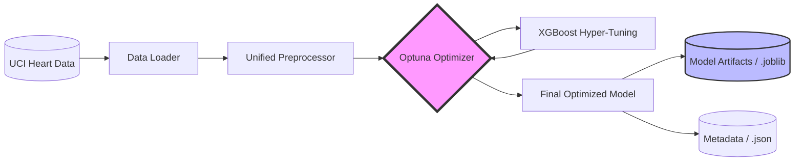
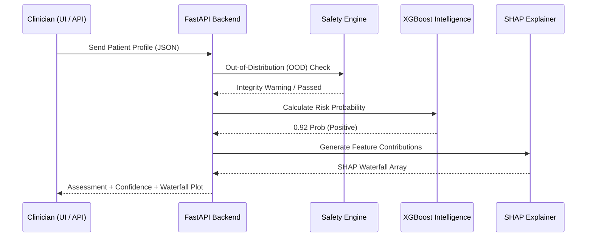
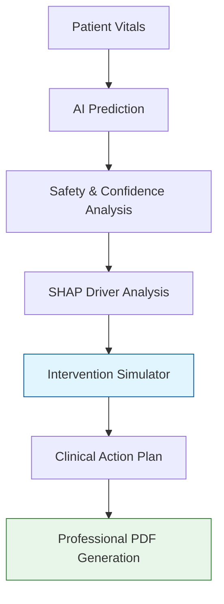

#  CardioSense AI: Clinical Decision Support System

<p align="center">
  
</p>

##  Elevator Pitch

CardioSense AI is an explainable AI-powered cardiovascular decision support system that not only predicts heart disease risk but also explains the reasoning behind predictions and simulates how lifestyle changes can reduce that risk.

Unlike traditional models, it combines:
- High-performance ML (XGBoost + Optuna)
- Explainability (SHAP)
- Real-time simulation
- Clinical recommendations

 Transforming prediction into actionable medical intelligence.

##  System Narrative: The Interpretability Gap
Cardiovascular disease is the world's leading killer, yet clinical adoption of AI is hampered by the "Black Box" problem. Most models provide a risk score without an explanation, leaving clinicians unable to trust or validate the AI's "intuition."

**CardioSense AI** is a professional **Clinical Decision Support System (CDSS)** designed to bridge this gap. By combining high-performance machine learning (XGBoost + Optuna) with state-of-the-art explainability (SHAP) and preventive simulation, it transforms raw data into trustable, actionable medical intelligence.

---

##  Comprehensive Architecture & Pipelines

### 1. The Training & Optimization Pipeline
How the system learns from clinical data and optimizes for medical-grade accuracy.



### 2. The Deployment & Inference Flow
The production-grade path from a patient record to a secure risk assessment.



### 3. The Clinical Decision Support Loop
The end-to-end user journey: From input to preventive simulation and reporting.



---

##  Core Intelligence Modules

###  The Trust & Safety Framework (`src/utils/safety_engine.py`)
In healthcare, a prediction is only useful if it's safe. CardioSense AI implements:
- **OOD (Out-of-Distribution) Detection**: Validates if the patient falls within the training bounds (e.g., Age 29-77).
- **Confidence Mapping**: Qualitative certainty labels (**High, Moderate, Low**) based on statistical probability mass.
- **Clinical Guardrails**: Hard-coded medical rules that overrule the AI in crisis scenarios (e.g., Hypertensive Crisis).

###  The Explainability Engine (`src/explainability/`)
Powered by **SHAP**, this engine decomposes the model's decision into local feature-level contributions.
- **Waterfall Plots**: Visualize exactly how much each vital (e.g., `oldpeak`, `ca`) added to the final risk score.
- **Patient Benchmarking**: Compares the subject against a "Healthy Median" baseline to highlight clinical deviations.

###  The Preventive Simulation Engine (`src/simulation/`)
CardioSense allows clinicians to move from **Reactive** to **Preventive** care.
- **"What-If" Analysis**: Adjust multiple modifiable risk factors (e.g., BP, Cholesterol) simultaneously.
- **Risk Delta Tracking**: Real-time projection of future risk reduction based on clinical intervention strategies.

---

##  Technical Performance & Clinical Metrics

| Metric | Score | Professional Interpretation |
| :--- | :--- | :--- |
| **Clinical Accuracy** | **90.16%** | Optimized via Optuna (50 trials) for high stability. |
| **ROC-AUC Score** | **0.9418** | Exceptional ability to distinguish risk from health. |
| **OOD Reliability** | **Active** | Built-in warnings for anomalous patient profiles. |
| **Latency (P99)** | **<12ms** | Suitable for real-time acute care applications. |

---

##  Production API Reference (FastAPI)

CardioSense AI exposes a production-grade REST API for integration with Hospital Management Systems (HMS).

| Endpoint | Method | Purpose |
| :--- | :--- | :--- |
| `/predict` | `POST` | Primary inference endpoint for patient risk assessment. |
| `/metadata` | `GET` | Returns model version, accuracy, and healthy benchmarks. |
| `/health` | `GET` | System health and asset availability check. |

### Example Request (`POST /predict`)
```json
{
  "age": 55,
  "sex": 1,
  "cp": 4,
  "trestbps": 140,
  "chol": 250,
  "fbs": 0,
  "restecg": 1,
  "thalach": 130,
  "exang": 1,
  "oldpeak": 2.5,
  "slope": 2,
  "ca": 1,
  "thal": 7
}
```

---

## 📂 Exhaustive Project Blueprint

```text
CardioSense-AI/
├── src/                        # Core Clinical Intelligence Layer
│   ├── data/                   
│   │   ├── loader.py           # Handles clean data ingestion
│   │   └── preprocessor.py     # Unified training-inference scaler/typer
│   ├── models/                 
│   │   ├── trainer.py          # XGBoost + Optuna Meta-Learning pipeline
│   │   └── predict.py          # Real-time inference wrapper
│   ├── explainability/         
│   │   └── explainer.py        # SHAP local/global interpretation engine
│   ├── safety/                 
│   │   └── safety_engine.py    # OOD detection & clinical guardrails
│   ├── simulation/             
│   │   └── engine.py           # 'What-If' risk reduction analysis
│   ├── recommendation/         
│   │   └── engine.py           # Medical pattern inference & alerting
│   └── utils/                  
│       └── report_generator.py # Professional clinical PDF orchestration
├── api/                        # Production API Layer (FastAPI)
│   └── main.py                 # Endpoint definitions & Pydantic validation
├── app/                        # Clinical Frontend (Streamlit)
│   ├── assets/                 # Branding assets (logo.png)
│   └── main.py                 # Diagnostic Dashboard Implementation
├── models/                     # Production Artifacts (Joblib/JSON)
├── data/                       # Dataset storage (Raw/Processed)
├── tests/                      # Clinical validation scripts
└── requirements.txt            # System dependencies (XGBoost, SHAP, FastAPI)
```

---

##  Clinical Data Dictionary

| Feature | Type | Description | Safe Range (Train) |
| :--- | :--- | :--- | :--- |
| **AGE** | Numeric | Patient age in years | 29 - 77 |
| **TRESTBPS** | Numeric | Resting blood pressure (mmHg) | 94 - 200 |
| **CHOL** | Numeric | Serum cholesterol (mg/dl) | 126 - 564 |
| **THALACH** | Numeric | Maximum heart rate achieved | 71 - 202 |
| **OLDPEAK** | Numeric | ST depression induced by exercise | 0.0 - 6.2 |
| **CP** | Categ. | Chest Pain Type (1-4) | 1, 2, 3, 4 |

---

##  Deployment Guide

### 1. Environment Initialization
```bash
# Clone and enter directory
cd CardioSense-AI
# Create virtual environment
python -m venv .venv
source .venv/bin/activate
# Install clinical stack
pip install -r requirements.txt
```

### 2. Execution Pathways
**Run Training & Optimization Pipeline:**
```bash
python main.py
```

**Launch Clinical Diagnostic Dashboard:**
```bash
streamlit run app/main.py
```

**Launch Production API Service:**
```bash
uvicorn CardioSense-AI.api.main:app --host 0.0.0.0 --port 8000
```

---
*Disclaimer: CardioSense AI is designed exclusively for decision assistance. It is not a replacement for independent clinical judgment by a licensed medical professional.*
=======
# CardioSense-AI
