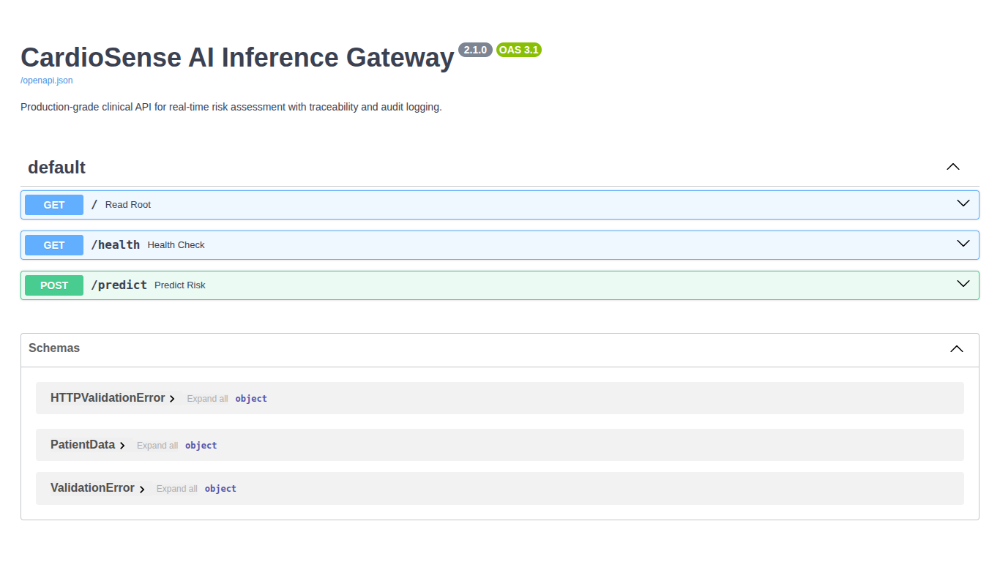

# Production API Guide: CardioSense AI

### Production Interface (FastAPI)



CardioSense AI exposes a production-grade FastAPI REST interface for seamless integration with Electronic Health Record (EHR) and Hospital Management Systems.

---

## 1. Base URL & Endpoints

- **Development**: `http://localhost:8000`
- **Production**: (Based on deployment)

| Endpoint | Method | Description |
| :--- | :--- | :--- |
| `/predict` | `POST` | Primary inference endpoint for patient risk assessment. |
| `/monitoring/status` | `GET` | (NEW) Returns data/concept drift and performance audit stats. |
| `/feedback/{id}` | `POST` | (NEW) Clinician endpoint for ground-truth outcome labeling. |
| `/health` | `GET` | System health check and clinical engine versioning. |
| `/docs` | `GET` | Interactive Swagger UI. |

---

## 2. API Reference

### POST `/predict`
Submit patient vitals to receive a heart disease risk probability.

**Injected Headers**:
- `X-Request-ID`: A unique UUID for audit tracing (e.g., `550e8400-e29b-411d-a716-446655440000`).

**Request Body (JSON)**:
```json
{
  "age": 55,
  "sex": 1,
  "cp": 4,
  "trestbps": 140,
  "chol": 250,
  "fbs": 0,
  "restecg": 1,
  "thalach": 130,
  "exang": 1,
  "oldpeak": 2.5,
  "slope": 2,
  "ca": 1,
  "thal": 7
}
```

**Response (JSON)**:
```json
{
    "prediction": 1,
    "risk_probability": 0.9234,
    "status": "Positive (High Risk)",
    "model_version": "2.4.0",
    "request_id": "550e8400-e2..."
}
```

### GET `/health`
Check if the system is online and the clinical engine is correctly loaded.

**Response (JSON)**:
```json
{
    "status": "healthy",
    "model_loaded": true,
    "model_version": "2.4.0",
    "uptime_heartbeat": 1712435...
}
```

---

### GET `/monitoring/status`
Returns a high-level summary of data stability and concept drift (performance decay).

**Response (JSON)**:
```json
{
    "drift": {
        "status": "success",
        "drift_share": 0.0,
        "dataset_drift": false,
        "target_drift_p": 0.9222,
        "columns_monitored": 25,
        "last_updated": "2026-04-06 08:40:56",
        "report_path": "reports/monitoring/data_drift.html"
    },
    "performance": {
        "status": "success",
        "current_recall": 0.881,
        "baseline_recall": 0.8929,
        "recall_drop": 0.0119,
        "feedback_count": 100,
        "concept_drift_detected": false
    },
    "timestamp": 1712435...
}
```

---

## 3. Production Features

### Clinical Auditability
Every request is assigned a unique `X-Request-ID`. This ID is returned in the response headers and logged alongside the inference results, enabling full downstream traceability for clinical audits.

### Structured Logging
CardioSense AI uses a rotating file-based JSON logger (`logs/cardiosense.log`). 
- **Rotation**: 5MB per file, max 3 backups.
- **Content**: API access logs, inference probability distribution, and internal trace IDs.

---

## 4. Implementation Examples

### Python Integration (with Tracing)
```python
import requests
import uuid

request_id = str(uuid.uuid4())
headers = {"X-Request-ID": request_id}

patient_data = { ... }

response = requests.post("http://localhost:8000/predict", json=patient_data, headers=headers)
print(f"Audit ID: {response.headers.get('X-Request-ID')}")
print(response.json())
```

---

## 5. Error & Status Codes

- `200 OK`: Success.
- `400 Bad Request`: Input validation failed or clinical logic error.
- `503 Service Unavailable`: Clinical engine weights not found.
- `500 Internal Error`: Global middleware caught an unhandled exception (stack traces are suppressed for security).
