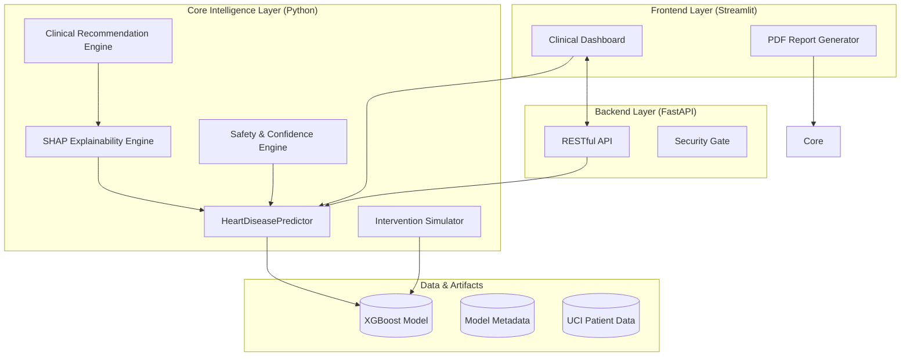
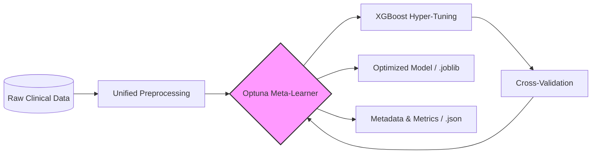
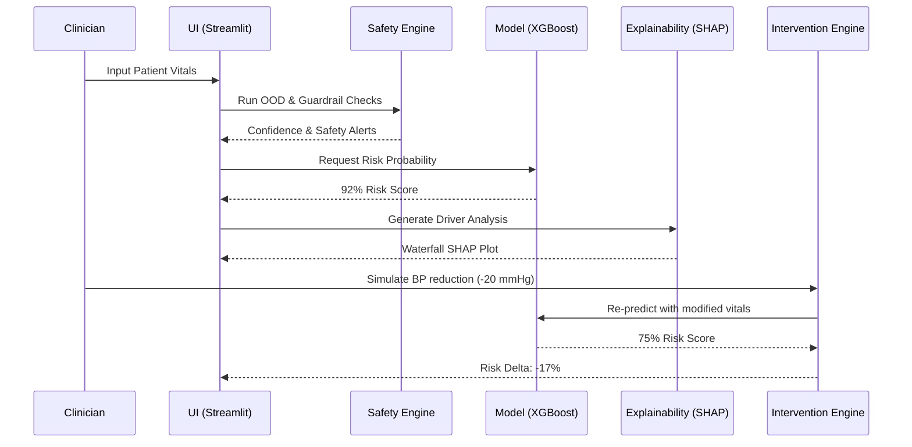

# System Architecture: CardioSense AI

CardioSense AI is a multi-layered Clinical Decision Support System (CDSS) designed for high-performance cardiovascular risk assessment with a focus on trust, interpretability, and safety.

---

## 1. High-Level Component Interaction

The system follows a decoupled architecture where the **Core Intelligence Layer** is wrapped by a **Production API (FastAPI)** and served through a **Clinical Dashboard (Streamlit)**.

---

## 2. The Training & Optimization Pipeline

We employ **XGBoost** as the primary engine, optimized via **Optuna** to ensure medical-grade accuracy.

---

## 3. The Clinical Inference Flow

This sequence illustrates the path from a patient profile to a "What-If" intervention simulation.

---

## 4. Safety & Trust Framework (`src/utils/safety_engine.py`)

In medical AI, "Black Box" models are unusable. We implement three layers of trust:

1.  **Out-of-Distribution (OOD) Detection**: Compares input data against the bounds of the training set (e.g., age ranges, BP maximums).
2.  **Clinical Guardrails**: Hard-coded medical rules that can signal a "Hypertensive Crisis" even if the AI doesn't detect heart disease.
3.  **Confidence Mapping**: A statistical derivation of model certainty, labeled as **High**, **Moderate**, or **Low**.

---

## 5. Explainability Layer (`src/explainability/`)

We use **SHAP (SHapley Additive exPlanations)** to ensure every prediction is explainable.
- **Local Explanations**: Waterfall plots showing exactly how each vital contributed to a specific patient's risk.
- **Global Explanations**: Summary plots showing the most important features across the entire population (e.g., `ca`, `oldpeak`, `thalach`).

---

## 6. Project Blueprint (Source Code Organization)

- `src/models/`: Training and real-time inference wrappers.
- `src/explainability/`: Logic for SHAP values and visualization.
- `src/simulation/`: The "What-If" engine for risk reduction projections.
- `src/recommendation/`: Pattern-based medical advice generation.
- `src/utils/`: Safety engines and report orchestration.
