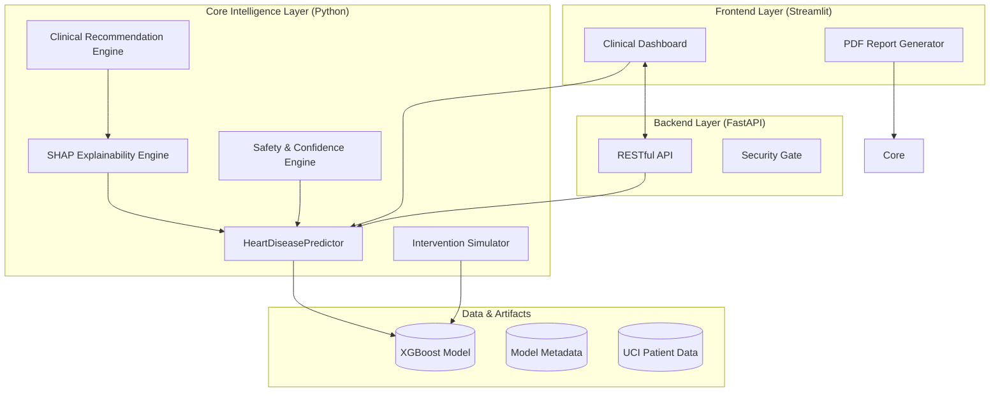
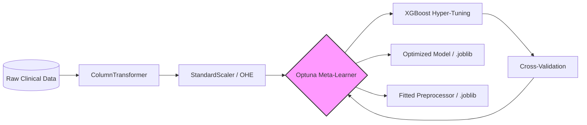
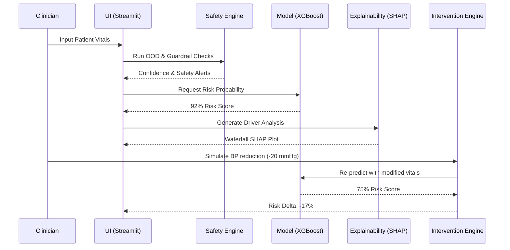

# System Architecture: CardioSense AI (v2.1.0)

CardioSense AI is a multi-layered Clinical Decision Support System (CDSS) designed for high-performance cardiovascular risk assessment with a focus on trust, interpretability, and safety.

---

## 1. High-Level Component Interaction

The system follows a decoupled architecture where the **Core Intelligence Layer** is wrapped by a **Production API (FastAPI)** and served through a **Clinical Dashboard (Streamlit)**.

---

## 2. The Training & Optimization Pipeline

We employ **XGBoost** as the primary engine, optimized via **Optuna** and supported by a **Production Preprocessing Pipeline** to ensure medical-grade accuracy and inference stability.

1.  **Robust Feature Engineering**:
    *   **Numerical Normalization**: `StandardScaler` is applied to all continuous vitals (`age`, `trestbps`, `chol`, `thalach`, `oldpeak`) to prevent feature-dominance and ensure gradient stability.
    *   **Categorical Encoding**: `OneHotEncoder(drop='if_binary')` converts clinical categorical markers (`sex`, `cp`, `fbs`, `restecg`, `exang`, `slope`, `ca`, `thal`) into a sparse, machine-readable format.
2.  **Pipeline Orchestration**: The entire transformation is wrapped in a Scikit-Learn `Pipeline`. This ensures that the exact same mathematical shifts are applied during real-time inference as were used during training, eliminating training-serving skew.

---

## 3. The Clinical Inference Flow

This sequence illustrates the path from a patient profile to a "What-If" intervention simulation.

---

## 4. Safety & Trust Framework (`src/utils/safety_engine.py`)

In medical AI, "Black Box" models are unusable. We implement four layers of trust:

1.  **Clinical Overrides**: Hard-stop medical rules based on ACC/AHA guidelines (e.g., Hypertensive Crisis, Ischemia detected in ECG) that trigger alerts regardless of AI probability.
2.  **Out-of-Distribution (OOD) Monitoring**: Compares input data against the statistical bounds of the training set (e.g., age ranges, BP maximums).
3.  **Entropy-Based Confidence**: Calculates the mathematical uncertainty of the model's output, labeled as **High**, **Moderate**, or **Low** based on probability distribution clusters.
4.  **Audit Hashes**: Every inference result is cryptographically linked to the model version and timestamp to ensure data integrity.

---

## 5. Optimization Engine (`src/simulation/engine.py`)

The **Risk Optimization Engine** moves beyond simple simulation to find the **Least Effort Path** to clinical stability.

- **Clinical Cost-Weights**: Each modifiable factor is assigned a "difficulty" (e.g., Blood Pressure: 1.0 vs. Max Heart Rate: 2.0) representing lifestyle feasibility.
- **Greedy Optimization**: The core algorithm identifies which changes yield the greatest risk reduction relative to their "effort."
- **Roadmap Generation**: Converts numerical optima into a prioritized, actionable clinical sequence.

---

## 6. Explainability Layer (`src/explainability/`)

We utilize a dual-engine interpretability layer to ensure every prediction is explainable from multiple mathematical perspectives:

1.  **SHAP (SHapley Additive exPlanations)**: Provides globally consistent local risk attribution using game-theoretic Shapley values.
    - **Local Explanations**: Waterfall plots showing exactly how each vital contributed to a specific patient's risk.
2.  **LIME (Local Interpretable Model-agnostic Explanations)**: Provides a local "linear surrogate" that approximates the complex model around a specific patient's data point.
    - **Sensitivity Analysis**: Reveals how small changes in patient vitals would affect the model's confidence, identifying the most "fragile" risk factors.

- **Model Reasoning Layer**: NLP-driven summarization of both SHAP and LIME signals to provide a plain-text "Physician's Summary" of the AI's logic.

---

## 7. Fairness-Aware Validation Pipeline

To meet modern medical-legal standards for AI, the training pipeline includes a **Bias Audit Layer**:

1.  **Slicing**: After the XGBoost model is optimized, the validation set is sliced into protected and clinical subgroups (e.g., `Sex`, `Age_LT45`, `Age_GT65`).
2.  **Parity Metrics**: The system calculates specialized metrics for each slice:
    *   **Recall Parity**: Ensuring high sensitivity across all groups to prevent false negatives in vulnerable populations.
    *   **Precision Stability**: Monitoring for consistent diagnostic quality.
3.  **Reporting**: These metrics are baked into the `model_metadata.json` and surfaced in the **System Integrity** dashboard for clinical transparency.

---

## 8. Project Blueprint (Source Code Organization)

- `api/`: Production FastAPI gateway and middleware.
- `app/`: Clinical Streamlit dashboard and UI logic.
- `src/models/`: Training and real-time inference wrappers.
- `src/explainability/`: Logic for SHAP values and model reasoning.
- `src/simulation/`: The cost-weighted Risk Optimization Engine.
- `src/recommendation/`: Pattern-based medical advice generation.
- `src/utils/`: Safety engines, PDF report orchestration, and logging.
- `tests/`: Multi-modal test suite (Clinical, API, and Inference).
