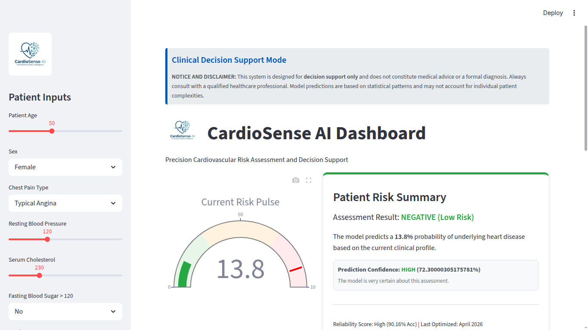
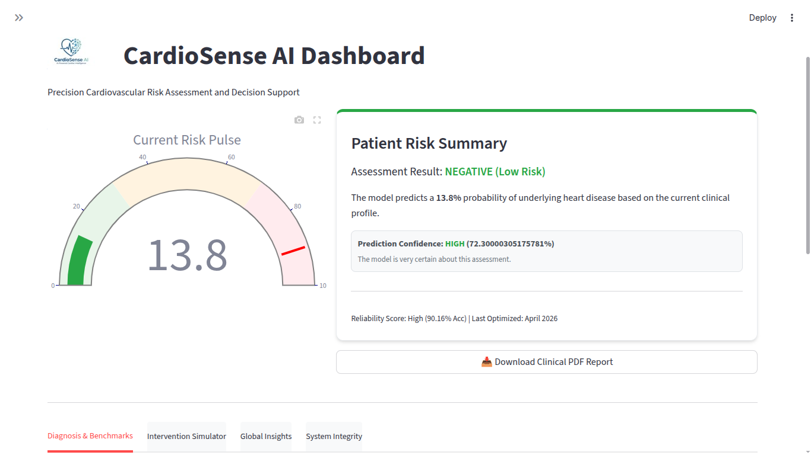
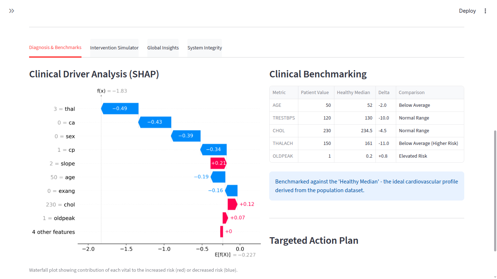
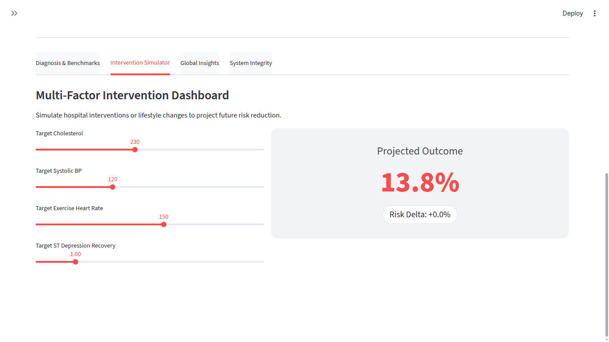
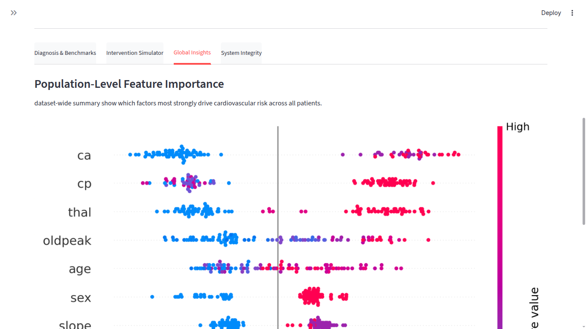
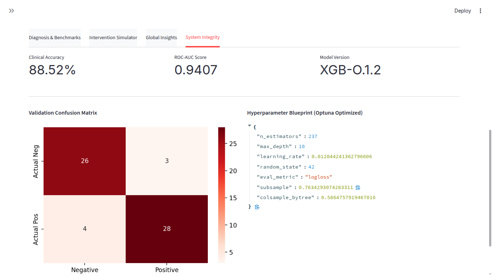

# Clinical User Guide: CardioSense AI

CardioSense AI facilitates advanced cardiovascular decision-making through an interactive dashboard and automated clinical reporting.

---

## 1. Dashboard Overview

The CardioSense AI dashboard provides a comprehensive medical interface for risk assessment.

  
  
  

### Patient Inputs & Risk Pulse
- **Sidebar**: Input traditional cardiovascular risk factors (Age, BP, Cholesterol, etc.).
- **Risk Pulse Gauge**: Real-time visual indicator of heart disease probability.
---

## 2. Deep Dive Modules

### Diagnosis & Benchmarks
Analyze the **underlying drivers** of the patient's risk.

- **SHAP Waterfall Analysis**: Visualizes exactly how many percentage points each vital contributed to the overall risk. Red bars indicate increased risk; blue bars indicate protective factors.
- **Patient Benchmarking**: Compare your patient's vitals against the **Healthy Median**.

### Intervention Simulator (What-If?)
Move from reactive to preventive care by simulating clinical interventions.

- Adjust **Cholesterol**, **BP**, or **Max Heart Rate** to see projected risk reduction.
- **Risk Delta**: Displays the percentage change in risk based on the intervention strategy.

### Global Insights
Understand population-level data drivers.

- View feature importance across the entire dataset to see which factors strongest drive risk globally.

### System Integrity
Audit the engine's reliability.

- Review **Accuracy**, **ROC-AUC**, and the **Confusion Matrix** to ensure clinical validity.

---

## 3. Interpreting the AI "Reasoning"

The SHAP Waterfall plot is the "X-Ray" of the model's decision. It decomposes the 0-100% risk probability into the specific clinical reasons for why a patient was flagged.

- **`E[f(X)]`**: The average model output (the starting baseline).
- **`f(X)`**: The final risk probability for this specific patient.
- **Red Features**: Clinical factors that pushed the risk **Higher**.
- **Blue Features**: Clinical factors that pushed the risk **Lower**.

---

## 4. Generating Clinical PDF Reports

After completing your assessment and running simulations, generate a professional report for the patient's medical file:

1.  Input clinician observations in the text field.
2.  Click **"Download Clinical PDF Report"**.
3.  The generated PDF includes:
    - Patient Risk Summary.
    - Full SHAP Waterfall Analysis.
    - Clinical Benchmarking Table.
    - Intervention Strategy projections.
    - Confidence scores and safety integrity logs.
