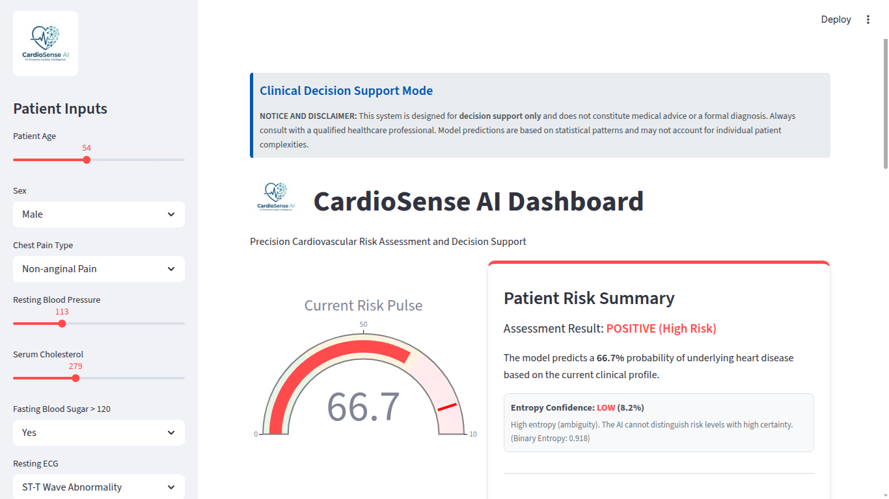
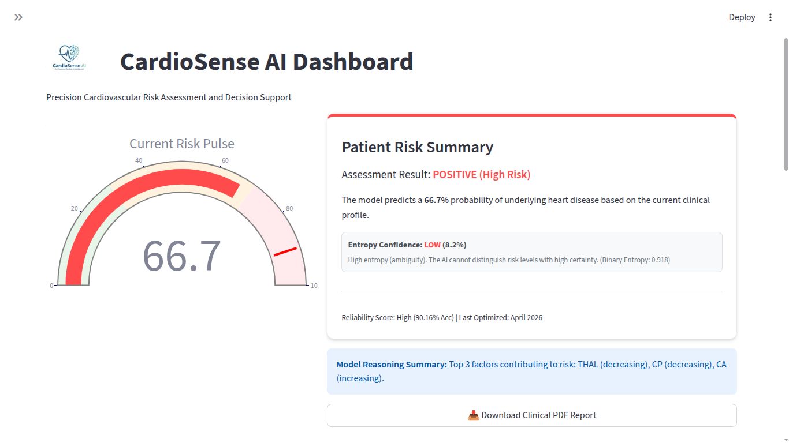
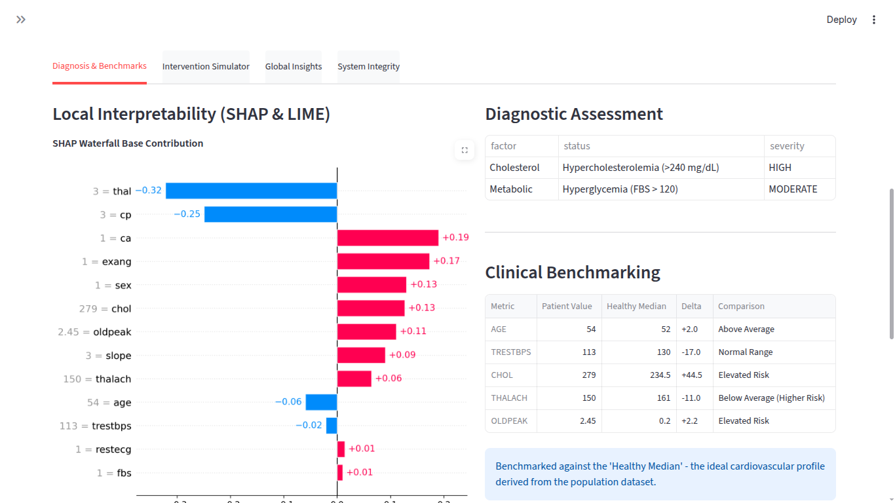
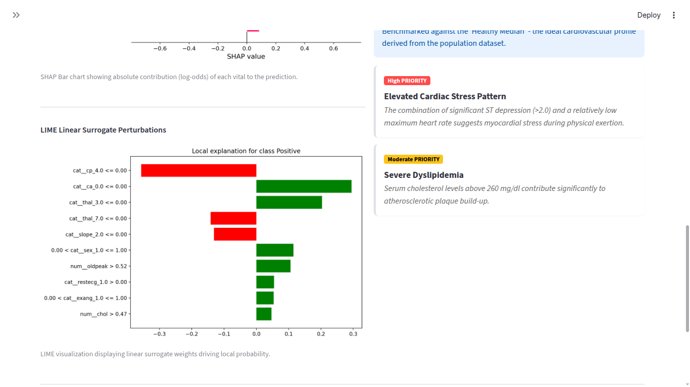
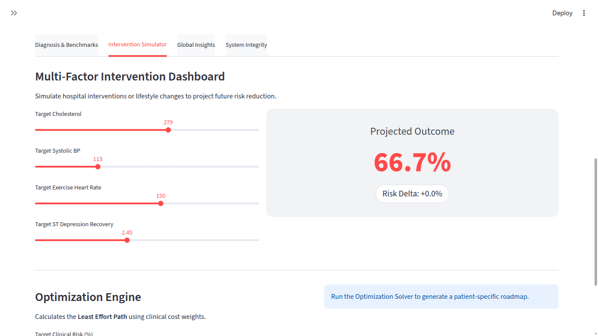
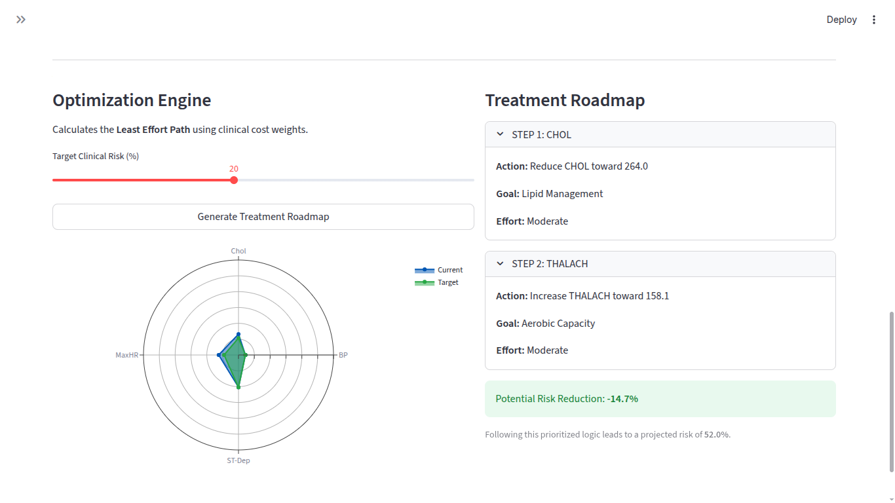
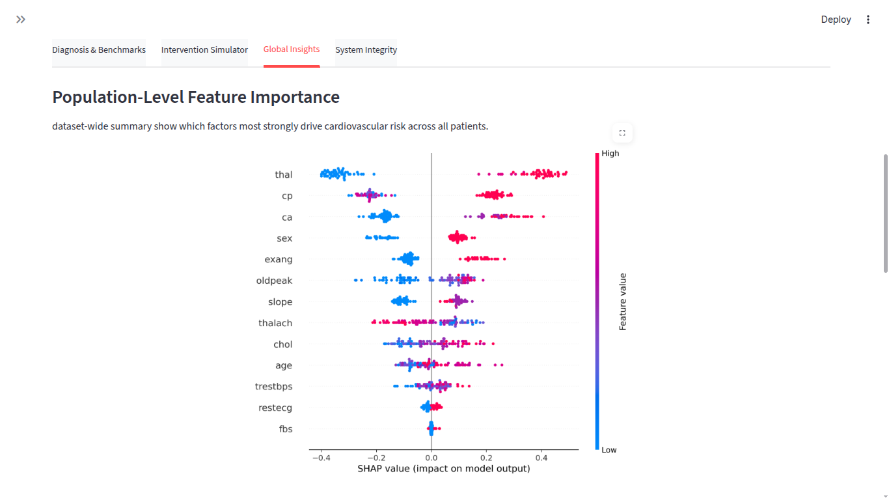
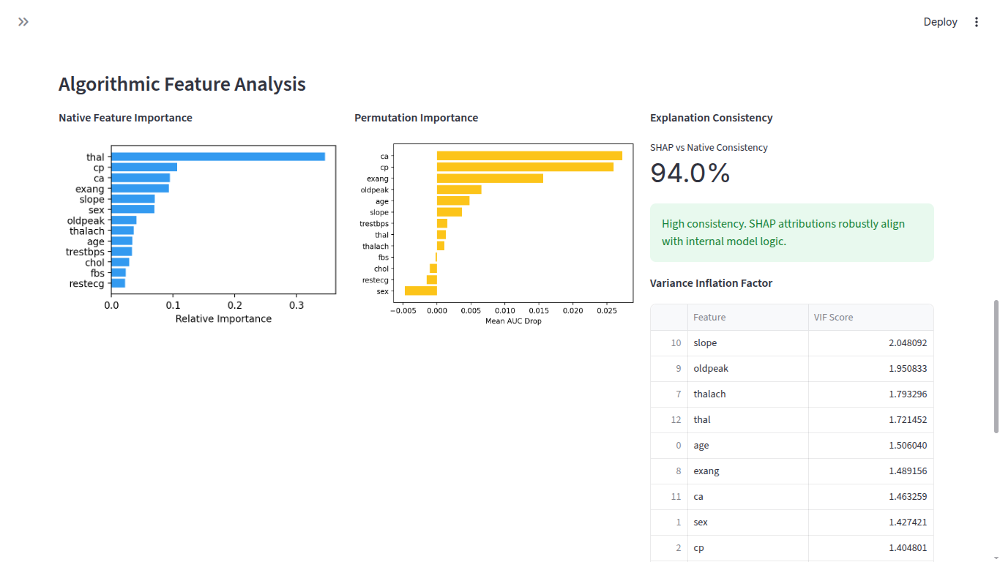
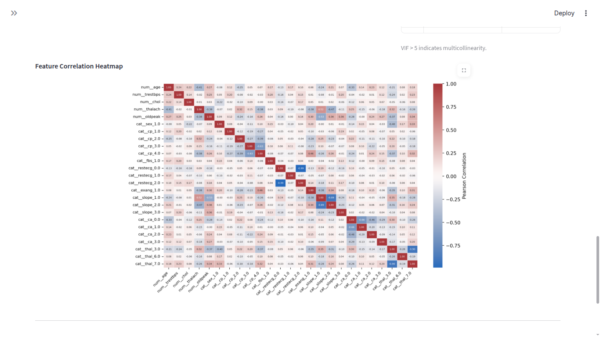
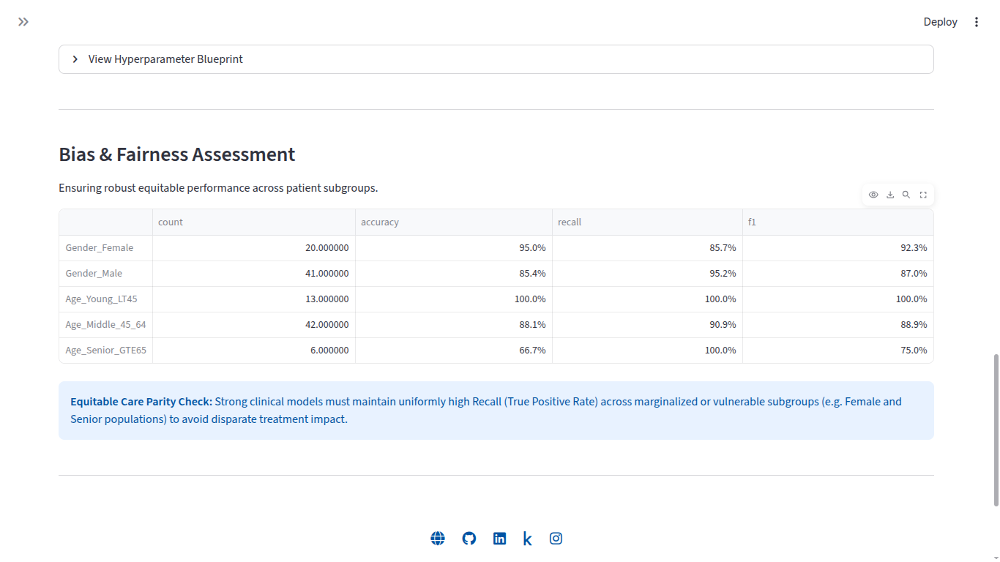

# Clinical User Guide: CardioSense AI (v2.1.0)

CardioSense AI facilitates advanced cardiovascular decision-making through an interactive dashboard and automated clinical reporting.

---

1. **Dashboard Overview**

The CardioSense AI dashboard provides a comprehensive medical interface for risk assessment.

  
  
  

### Patient Inputs & Risk Pulse
- **Sidebar**: Input traditional cardiovascular risk factors (Age, BP, Cholesterol, etc.).
- **Reliability Score**: Active v2.1.0 engine (**90.16% Acc**) ensures production-grade stability.

---

2. **Deep Dive Modules**

### Diagnosis & Benchmarks
Analyze the **underlying drivers** of the patient's risk.

- **SHAP Waterfall Analysis**: Visualizes exactly how many percentage points each vital contributed to the overall risk. Red bars indicate increased risk; blue bars indicate protective factors.
- **LIME Linear Surrogates**: Provides a "local linear" view of the model's decision. It shows which features are most sensitive for that specific patient.
- **Patient Benchmarking**: Compare your patient's vitals against the **Healthy Median**.

### Risk Optimization Engine (Least Effort Path)
Move beyond simple "What-If" analysis to an AI-driven clinical strategy.

1. **Strategic Optimization**: Select a "Target Risk" percentage and run the solver.
2. **Spider (Radar) Visualization**: 
   - **Blue Shape**: The patient's high-risk profile.
   - **Green Shape**: The AI-calculated "Path to Green."
3. **Treatment Roadmap**: A prioritized sequence of lifestyle actions ranked by their risk-reduction ROI relative to effort.

---

3. **Interpreting the AI "Reasoning"**

The SHAP Waterfall plot is the "X-Ray" of the model's decision. It decomposes the 0-100% risk probability into the specific clinical reasons for why a patient was flagged.

- **`E[f(X)]`**: The average model output (the starting baseline).
- **`f(X)`**: The final risk probability for this specific patient.
- **Red Features**: Clinical factors that pushed the risk **Higher**.
- **Blue Features**: Clinical factors that pushed the risk **Lower**.

---

4. **Global Insights & Fairness**

### Population-Level Feature Importance
Understand dataset-wide summary drivers across all patients.

### Fairness & Equitable Care
CardioSense AI is audited to ensure that the AI model performs reliably across all patient demographics.

- **Regional Parity**: We prioritize high **Recall (Sensitivity)** in historically marginalized or vulnerable subgroups (e.g., Female and Senior populations) to ensure no high-risk patient is missed due to algorithmic bias.

---

5. **Medical Safety Guardrails**

The engine implements a **multi-layered safety framework** to prevent AI hallucination in high-risk scenarios.

### Clinical Overrides (ACC/AHA Alignment)
The system will automatically escalate risk to **POSITIVE** if critical life-safety thresholds are breached:
- **Hypertensive Crisis**: Systolic BP >= 180 mmHg.
- **Multivessel Disease**: Number of major vessels (ca) >= 2.
- **Ischemic Severity**: ST depression (oldpeak) > 3.0.

### Entropy-Based Confidence
Every prediction includes a **Confidence Gauge** (1.0 - H(p)). These values are now more stable due to the **v2.1.0 Robust Preprocessing Pipeline**:
- **HIGH**: The AI has a clear, focused statistical rationale.
- **MODERATE**: Requires physician review.
- **LOW**: High entropy/ambiguity. The AI indicates a "Boundary Case."

---

6. **Generating Clinical PDF Reports**

After completing your assessment, generate a professional report for the patient's medical file:
1.  Input clinician observations.
2.  Click **"Download Clinical PDF Report"**.
    - **Clinical Radar Chart**: current vs. target profiles.
    - **Intervention Roadmap**: prioritized treatment steps.
    - **Clinical Audit Hash**: cryptographic link for medical records.
